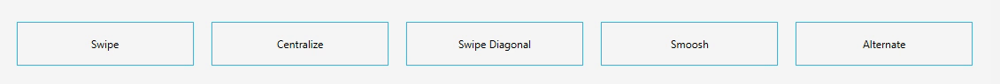

[](https://github.com/Gleidson28/GNCarousel/blob/master/LICENSE) 

<h1></h1>

<p align="center">
  
</p>

<h1></h1>
<h6 align="center"> This project is part of the set of custom components created for JavaFx. </h6>

<h1></h1>

<h1> GNButton </h1>

<h5 > 
  JavaFx Button Hover Effect.
</h5>

 > This component is a animated button with layers.


<h1></h1>

<h5>Basic Usage</h5>

```java
GNButton swipe = new GNButton("Swipe");
swipe.setButtonType(ButtonType.SWIPE);
swipe.setTransitionColor(Color.RED);
swipe.setTransitionText(Color.WHITE);
swipe.setTransitionDuration(Duration.ZERO);
```

<h1></h1>

<h5>Inline css  </h5>

```java
 -gn-button-type : swipe;
 -gn-transition-color : #33B5E5;
 -gn-transition-text : white;
 -gn-transition-duration : 500m;
```
<h5>View</h5>

<p align="center"></p>
